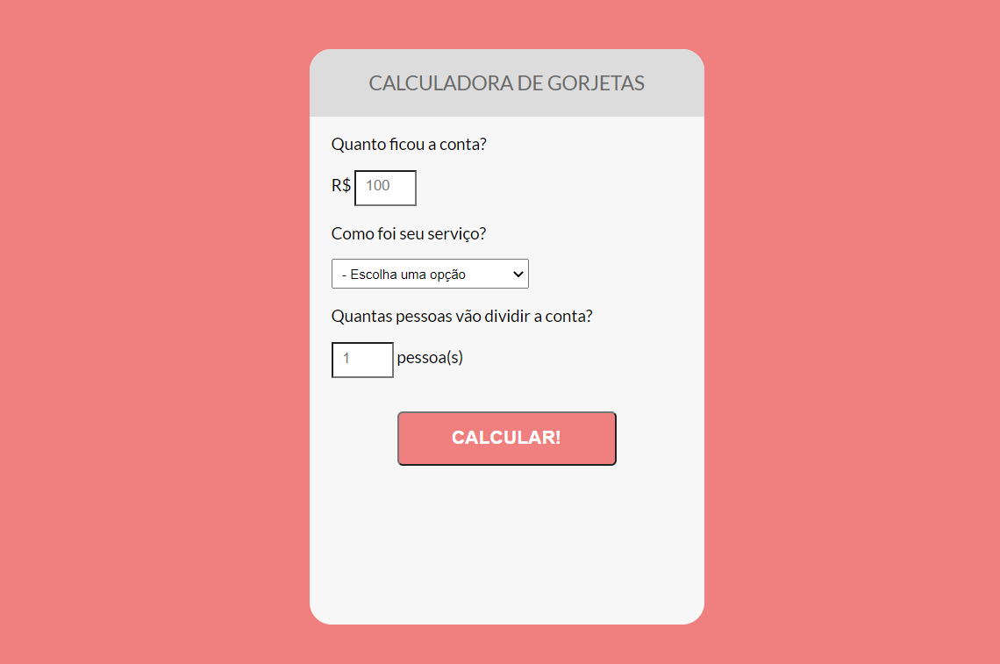

# Calculadora de Gorjetas

##### Projeto desenvolvido na série Start na Carreira de Programação promovido pelo Onebitcode com HTML, CSS e Javascript.
 
O intuito do projeto foi criar uma calculadora de gorjetas para que o usuário tenha facilmente o valor de gorjeta a ser pago por cada pessoa.
 
 
Para o desenvolvimento deste projeto foram utilizados HTML, CSS e Javascript.
 
 

  

